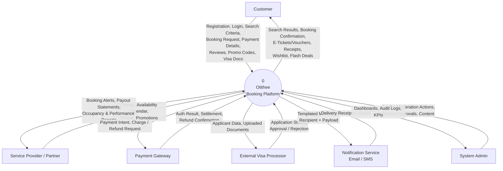
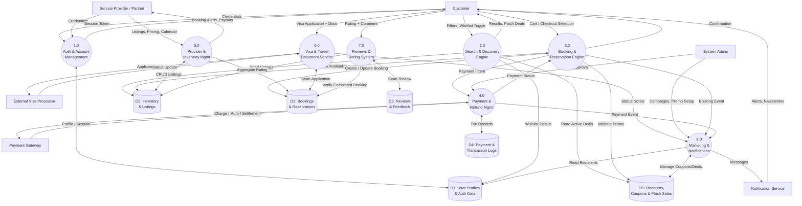
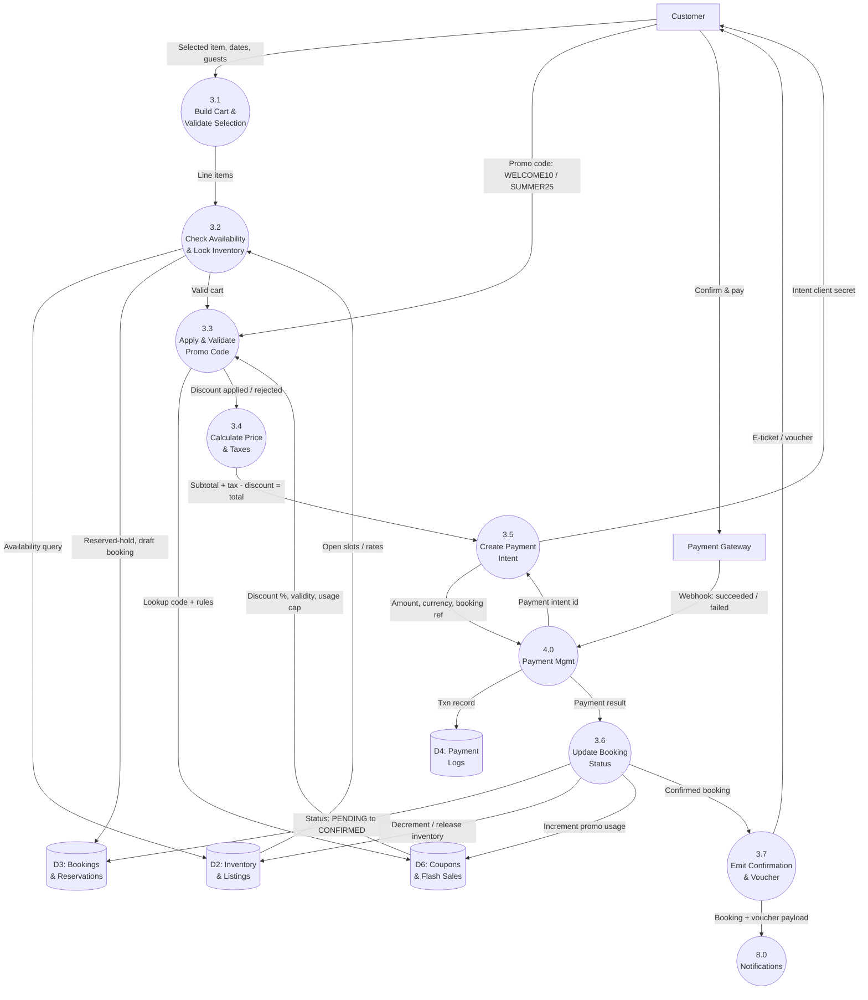
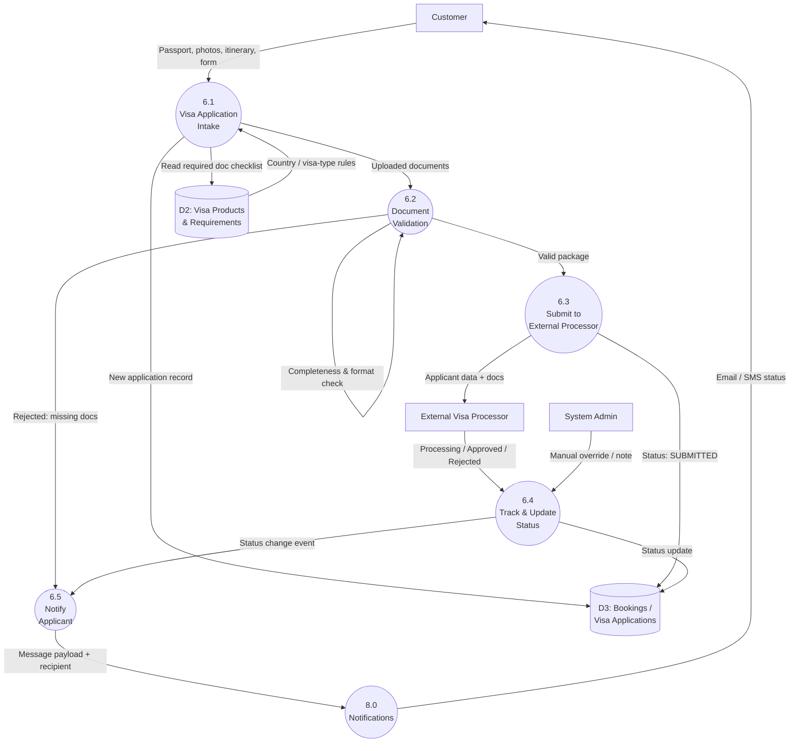

# Otithee — Data Flow Diagram (DFD) Suite

A complete, multi-level Data Flow Diagram for the Otithee all-in-one travel booking
platform (Stays, Experiences & Services, Promotions & Loyalty, and User/Provider
Management).

**Notation used throughout**

- External Entity → `[Rectangle]`
- Process → `((Circle))`
- Data Store → `[(Cylinder)]`

---

## 1. Context Diagram — DFD Level 0

The entire platform is modeled as a single process (`0`). Only the boundary flows
between Otithee and the outside world are shown.

---

## 2. Overview Diagram — DFD Level 1

The `0` process is decomposed into 8 core processes (1.0–8.0) with the 6 primary
data stores (D1–D6).

---

## 3. Data Stores Reference (D1–D6)

| ID | Data Store | Primary Contents | Written by | Read by |
|----|------------|------------------|------------|---------|
| **D1** | User Profiles & Auth Data | Credentials, roles (Customer/Superhost/Admin), sessions, wishlists, newsletter opt-in, loyalty tier | 1.0, 2.0 | 1.0, 2.0, 8.0 |
| **D2** | Inventory & Listings | Stays, tours, transport, visa products, availability calendar, pricing, aggregate ratings | 5.0, 7.0 | 2.0, 3.0, 5.0 |
| **D3** | Bookings & Reservations | Reservation records, status, guest/traveler details, visa applications | 3.0, 6.0 | 3.0, 5.0, 6.0, 7.0 |
| **D4** | Payment & Transaction Logs | Payment intents, charges, refunds, payout ledger, gateway references | 4.0 | 4.0 |
| **D5** | Reviews & Feedback | Ratings, comments, provider responses, moderation flags | 7.0 | 7.0 |
| **D6** | Discounts, Coupons & Flash Sales | Promo codes (WELCOME10, SUMMER25), member discounts, flash-deal windows, usage limits | 8.0 | 2.0, 3.0, 8.0 |

---

## 4. Level 2 — Process 3.0: Booking & Reservation Engine

Step-by-step transformation from checkout selection → promo validation → payment
intent → status update → confirmation emission.

**Key data transformations in 3.0**

| Step | Input | Transformation | Output |
|------|-------|----------------|--------|
| 3.1 | Item, dates, guest count | Structure into line items | Validated cart |
| 3.2 | Cart | Availability check + soft-lock | Draft booking (`PENDING`) in D3 |
| 3.3 | Promo code + cart | Rule/expiry/usage-cap check | Accept or reject discount |
| 3.4 | Subtotal, tax, discount | `total = subtotal + tax - discount` | Final payable amount |
| 3.5 | Amount + booking ref | Create payment intent via 4.0 | Client secret to customer |
| 3.6 | Gateway result | State machine `PENDING → CONFIRMED / FAILED` | Committed booking, inventory & promo updated |
| 3.7 | Confirmed booking | Render voucher + trigger notify | E-ticket + event to 8.0 |

---

## 5. Level 2 — Process 6.0: Visa & Travel Document Assistance

Document intake → status processing → notification flow.

**Key data transformations in 6.0**

| Step | Input | Transformation | Output |
|------|-------|----------------|--------|
| 6.1 | Uploaded docs + form | Match against country/visa requirements (D2) | Application record (`DRAFT`) in D3 |
| 6.2 | Documents | Completeness & format validation | Valid package **or** rejection notice |
| 6.3 | Valid package | Forward to external processor | `SUBMITTED` status |
| 6.4 | Processor / admin updates | State machine `SUBMITTED → PROCESSING → APPROVED/REJECTED` | Updated D3 + status event |
| 6.5 | Status event | Compose notification | Message to 8.0 → Customer |

---

## 6. Consolidated Data-Flow Mapping Table

| # | Data Flow | Source | Destination | Data Elements |
|---|-----------|--------|-------------|---------------|
| 1 | Registration/Login | Customer | 1.0 | Email, password, profile, OTP |
| 2 | Session token | 1.0 | Customer | JWT/session id, role |
| 3 | Search criteria | Customer | 2.0 | Location, dates, guests, category, price filters |
| 4 | Search results | 2.0 | Customer | Ranked listings, flash deals, ratings |
| 5 | Wishlist toggle | Customer | 2.0 → D1 | User id, listing id |
| 6 | Listing/pricing/calendar | Provider | 5.0 → D2 | Listing details, rates, availability |
| 7 | Checkout selection | Customer | 3.0 | Listing id, dates, guests, add-ons |
| 8 | Promo validation | 3.0 ↔ D6 | — | Code (WELCOME10/SUMMER25), discount %, usage cap |
| 9 | Payment intent | 3.0/4.0 → Payment Gateway | — | Amount, currency, booking ref |
| 10 | Auth/settlement | Payment Gateway | 4.0 → D4 | Txn id, status, amount |
| 11 | Booking confirmation | 3.0 → Customer / 8.0 | — | Booking id, voucher/e-ticket |
| 12 | Refund request | 4.0 (Admin-approved) → Payment Gateway | — | Txn id, refund amount |
| 13 | Visa application | Customer | 6.0 → D3 | Passport, photos, itinerary, form |
| 14 | Visa submission | 6.0 → Visa Processor | — | Applicant data, documents |
| 15 | Visa status | Visa Processor | 6.0 → D3 → 8.0 | Application id, status |
| 16 | Review submission | Customer | 7.0 → D5 | Booking id, rating, comment |
| 17 | Aggregate rating | 7.0 → D2 | — | Listing id, avg score, count |
| 18 | Campaign/promo setup | Admin | 8.0 → D6 | Coupon rules, flash-deal windows |
| 19 | Notification dispatch | 8.0 → Notification Service | — | Recipient, template, payload |
| 20 | Payout statement | 5.0 → Provider | — | Provider id, earnings, period |
| 21 | Delivery receipt | Notification Service | 8.0 | Message id, delivery status |
