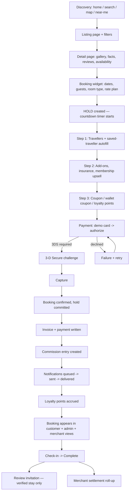
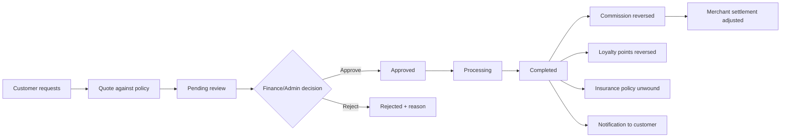
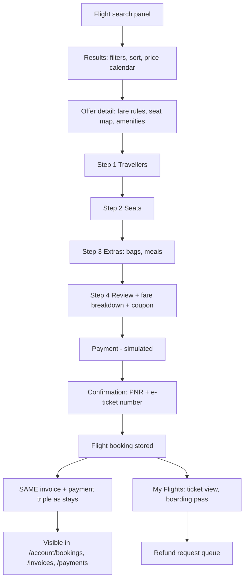
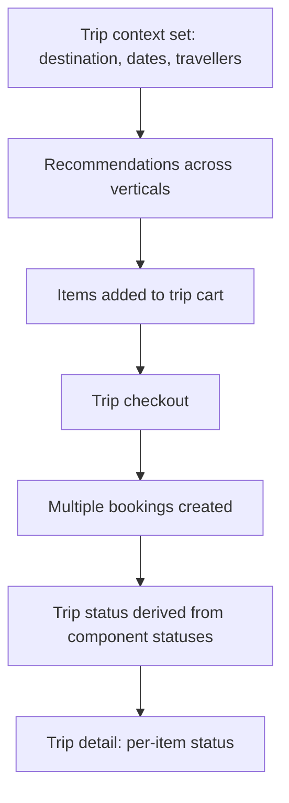
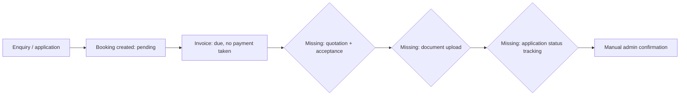

# 05 — Booking Lifecycle Analysis

## The stay booking lifecycle — traced against code

**Every step above exists in code and is exercised by the regression suite.** The three simulated steps are payment authorisation, notification delivery, and the money actually moving.

### Step-by-step verification

| Step | Status | Where |
|---|---|---|
| Discovery | ✅ | `search/`, `discovery/`, home sections |
| Listing + filters | ✅ | `sections/listing/*` |
| Details | ✅ | `sections/detail/*` |
| Availability check | ✅ real engine | `domain/inventory.ts` |
| Inventory hold + timer | ✅ | `createHold`, `components/checkout/hold-timer.tsx` |
| Traveller collection | ✅ | `checkout/traveler-fields.tsx`, saved travellers |
| Add-ons | ✅ per-vertical catalogue | `features/booking/add-ons.ts` |
| Insurance | ✅ | `checkout/insurance-picker.tsx`, `domain/insurance.ts` |
| Membership upsell | ✅ | `checkout/membership-upsell.tsx` |
| Discounts (promo, wallet, points) | ✅ | `offerService`, `engagement.ts` |
| Pricing | ✅ single engine | `domain/money.ts` → `priceBooking` |
| Payment | 🔵 simulated | `domain/payments.ts` |
| 3-D Secure | 🔵 simulated | `submitAuthentication` |
| Retry after decline | ✅ | `attemptPayment` |
| Confirmation | ✅ | `confirmBooking` |
| Invoice + payment record | ✅ | `services/checkout.ts` |
| Commission | ✅ | `commissionService`, `commission-rules.ts` |
| Notifications | 🔵 outbox only | `domain/messaging.ts` |
| Loyalty accrual | ✅ | `loyaltyService` |
| Vendor fulfilment | 🟡 status only | `bookingService.transition` |
| Check-in / completion | ✅ | lifecycle transitions |
| Review | ✅ verified-only | `domain/reviews.ts` |
| Cancellation | ✅ | `quoteCancellation`, policy tiers |
| Refund | ✅ full lifecycle | `refundService` |
| Amendment | ✅ | `domain/amendments.ts` |
| Settlement | ✅ | `settlementService` |

---

## Booking state machine

`lifecycle.ts` is the **only** place a transition is declared legal. Services call `assertTransition` before mutating; UIs call `availableBookingActions` to decide which buttons to render — so the dashboard can never offer an action the domain would reject.

Declared transitions: `capture_payment`, `confirm`, `retry_payment`, `mark_failed`, `check_in`, `complete`, `request_cancellation`, `cancel`, `initiate_refund`, `process_refund`, `complete_refund`.

Cancellation policies: **flexible**, **moderate**, **strict**, **non_refundable** — each with tiers that drive the refund quote by how close to arrival the cancellation lands.

---

## Refund lifecycle

Everything downstream of "Completed" — commission reversal, settlement adjustment, points reversal, policy unwind — is implemented and covered by tests. **What is missing is the money leaving the platform's account**, because there is no gateway.

Refunds can be raised from three directions: the customer (`/account/refunds`), an agent (`refundService.requestExternal`), and the admin queue (`/dashboard/finance/refunds`) — all writing to the same records.

---

## Flight booking lifecycle

**Broken/missing steps:** no supplier confirmation, no ticketing, no schedule-change handling, no automatic refund processing (flight refunds land in a request queue and stop there), and cancellation is a request rather than a state transition.

---

## Trip (multi-product) lifecycle

**Implemented:** shared context, cross-vertical recommendations, combo pricing, combined checkout, derived trip status, partial confirmation as a concept.
**Missing:** one payment split across suppliers with allocation, one cancellation across the trip, refund orchestration when one component fails, a unified itinerary document, a single trip-level booking reference presented to the customer.

---

## Request-product lifecycle (visa, convention hall)

Only the first three steps exist. Everything after "invoice due" is manual and undocumented in the product.

---

## Where the lifecycle is broken, mocked or disconnected

| Break | Severity | Detail |
|---|---|---|
| **Payment is simulated** | Critical | Outcome is chosen by which demo card the user picks. No money moves, no gateway, no webhook, no reconciliation with a processor. |
| **Notifications never leave the browser** | Critical | 10 templates across 5 channels write to an in-memory outbox. The customer "receives" them because the same array backs their inbox. |
| **No supplier confirmation loop** | Critical | A booking is confirmed by the platform alone. In reality a hotel or airline must accept it, and can reject it. |
| **Vendor fulfilment is a status change** | High | There is no operational handover — no rooming list, no manifest, no voucher the supplier can scan. |
| **Payouts never execute** | High | Settlements compute correctly and advance status; no bank rail exists. |
| **No documents produced** | High | No PDF invoice, voucher, e-ticket or receipt is generated. |
| **Data is per-browser** | Critical | The customer's booking and the admin's view are the same record *only because they are the same browser*. In reality they are different people on different machines. |
| **Client-authoritative pricing** | Critical | `priceBooking` runs in the browser. A user can alter the inputs. |
| **Flight refunds dead-end** | Medium | They enter a queue but have no processing lifecycle. |
| **Reviews have no notification trigger** | Low | A "review invitation" template exists but no scheduled job sends it — there are no jobs. |
