# 06 — Vendor / Merchant Ecosystem

## Summary

The vendor **operating** experience is well built. The vendor **joining** experience does not exist.

A merchant who is already on the platform gets a scoped dashboard, real inventory and rate control, real bookings, real earnings and real settlements. But there is no way to become a merchant: no application form, no verification, no document upload, no approval queue, no contract, no bank details. Merchants exist because they are in a seed array.

---

## Two merchant models exist — a contradiction

| Model | Where | Fields | Used by |
|---|---|---|---|
| `MerchantRef` | `domain/seed.ts` | id, name, commissionRate | Bookings, commission, settlements, scoping — **the real one** |
| `Merchant` | `modules/merchants/*` | id, name, email, contactName, category, country, properties, commissionRate (0–1 ratio), revenue, currency, status, joinedAt | The admin Merchants CRUD screen — **stub-backed, resets on reload** |

Ten domain merchants exist (`mrc_azure` … `mrc_visahub`) with negotiated commission rates from 5% to 18%. The admin Merchants screen manages a *different, unrelated* set. **Creating a merchant in the admin UI does not create one the booking engine can use.** This is the single clearest UI-versus-domain contradiction in the repository.

Note also the unit mismatch: domain commission rates are percentages (`12`), the merchants module uses ratios (`0.08`). Any migration must reconcile this.

---

## Vendor lifecycle — verified

```mermaid
flowchart LR
  R[Registration] --> V[Verification]
  V --> O[Onboarding]
  O --> P[Product creation]
  P --> A[Approval]
  A --> PUB[Publishing]
  PUB --> B[Booking]
  B --> F[Fulfilment]
  F --> C[Commission]
  C --> S[Settlement]
  S --> PO[Payout]

  style R fill:#fee,stroke:#c00
  style V fill:#fee,stroke:#c00
  style O fill:#fee,stroke:#c00
  style A fill:#fee,stroke:#c00
  style PUB fill:#ffe,stroke:#c90
  style F fill:#ffe,stroke:#c90
  style PO fill:#fee,stroke:#c00
```

Red = missing · Amber = partial · Unmarked = implemented

| Stage | Status | Evidence |
|---|---|---|
| Registration | 🔴 Missing | Sign-up creates a `traveler`. No merchant application path exists. |
| Verification / KYC | 🔴 Missing | No KYC types, no document model, no verification status beyond a four-value `status` field on a stub record. |
| Onboarding | 🔴 Missing | No wizard, no checklist, no contract acceptance, no bank details, no tax registration. |
| Business profile | 🟡 Partial | Name, contact, category, country on the stub record. No logo, description, policies, addresses, licences or opening hours. |
| Product creation | 🟡 Partial | Full CRUD forms per vertical with Zod validation — but stub-backed, so created products never reach the public catalogue. |
| Approval | 🔴 Missing | No submission → review → approve/reject workflow for catalogue items. (One does exist for CMS pages.) |
| Publishing | 🟡 Partial | Public listings come from `constants/listings.ts`, entirely separate from the dashboard catalog. |
| Inventory | ✅ Implemented | Room types, per-night allotment, overrides, holds, consumed units. |
| Pricing | ✅ Implemented | Rate plans, per-night rates, bulk update, revenue-management rules and recommendations. |
| Availability | ✅ Implemented | Real availability check that prevents double-booking. |
| Booking management | ✅ Implemented | Scoped list, detail, timeline, legal actions, amendments. |
| Fulfilment | 🟡 Partial | Status transitions only. No rooming list, manifest, voucher scan or supplier-side confirmation. |
| Customer management | 🟡 Partial | Merchants can read customers; no CRM, notes or history beyond bookings. |
| Staff management | 🔴 Missing | A merchant cannot create sub-users. `B2BSubUser` exists for agencies but has no merchant equivalent and no login. |
| Commission | ✅ Implemented | Rule engine with merchant-level targeting; negotiated rate overrides product default. |
| Payout | 🟡 Partial | Payouts module is stub-backed; settlements (domain-backed) compute correctly but no bank rail exists. |
| Settlement | ✅ Implemented | Roll-up per merchant, refund adjustment, status advance, tested. |
| Reports | ✅ Implemented | Scoped reporting and CSV export. |
| Analytics | ✅ Implemented | Merchant-scoped charts. |
| Promotions | ✅ Implemented | Merchant-scoped offers with create/update/delete rights. |
| Coupons | ✅ Implemented | Via the offers engine (`promo_code` type). |
| Advertising | ✅ Implemented (admin side) | Advertisers can be merchants; campaigns, budgets, pricing models, billing. No **merchant-facing** self-serve ad buying UI. |
| Reviews | ✅ Implemented | Read and reply, verified-stay only. |
| Notifications | 🔵 Mock | Merchant audience exists in the notification model. |
| Support | ✅ Implemented | Merchants can raise and read tickets. |
| Subscription plans | 🟡 Partial | B2B subscription charging exists (`b2bService.chargeSubscription`); there is **no merchant subscription plan** product. |

---

## What merchants can see and do — verified boundaries

Permissions from `rbac/roles.ts`, scoping verified by regression test:

- ✅ Own catalog (full control), own bookings (read + update), own promotions (full), own reviews (read + reply), own finances (read + export), own reports, support tickets, own profile.
- ❌ Approve refunds, edit commission rules, run settlements, manage other merchants, change platform settings, access system tools, manage users.

The source comment is explicit about the reasoning, and the boundary is drawn in the right place: merchants control supply and demand generation; the platform controls money decisions.

---

## Missing components for a real marketplace

### Critical
1. **Merchant registration and application flow** — the gate on all supply.
2. **KYC / verification** — business registration, tax ID, ownership, licence, sanctions screening. Nothing exists.
3. **Bank account and payout details** — settlements compute a number that has nowhere to go.
4. **Contract and commercial terms acceptance** — no record of what a merchant agreed to.
5. **Unified merchant model** — reconcile `MerchantRef` and `Merchant`.
6. **Media upload** — every catalog form assumes images exist; none can be uploaded.

### High priority
7. **Catalogue approval workflow** — submission, review, rejection with reasons, re-submission.
8. **Merchant staff accounts and roles** — front desk, reservations, revenue manager.
9. **Channel manager connectivity** — a hotel already selling on other OTAs needs rate/availability sync or it will oversell.
10. **Merchant onboarding progress and health score** — completeness, response rate, cancellation rate.
11. **Payout schedule and statements** — cadence, minimum thresholds, holdbacks, downloadable statements.
12. **Merchant-facing self-serve advertising** — the revenue logic exists; the shop window does not.

### Medium priority
13. **Merchant subscription tiers** — a modelled but unbuilt revenue stream (basic/professional/premium).
14. **Performance dashboards** — conversion, ranking position, competitor set.
15. **Merchant mobile experience** — critical for property operators.
16. **Dispute participation** — merchants cannot currently respond to a dispute.
17. **Multi-property grouping** — one login, many properties.
18. **Merchant API** — for PMS integration.

---

## Revenue implications

The merchant side is where most platform revenue originates, and three streams are logic-complete but commercially unreachable because merchants cannot self-onboard:

| Stream | Logic status | Blocker |
|---|---|---|
| Booking commission (5–18%) | ✅ Complete rule engine | No supply acquisition path |
| Merchant advertising | ✅ Complete billing model | No merchant-facing purchase UI |
| Merchant subscriptions | 🔴 Not modelled for merchants | Needs plan definition + billing |

Fixing merchant onboarding is therefore not just a completeness item — it is the unlock for the platform's primary revenue line.
