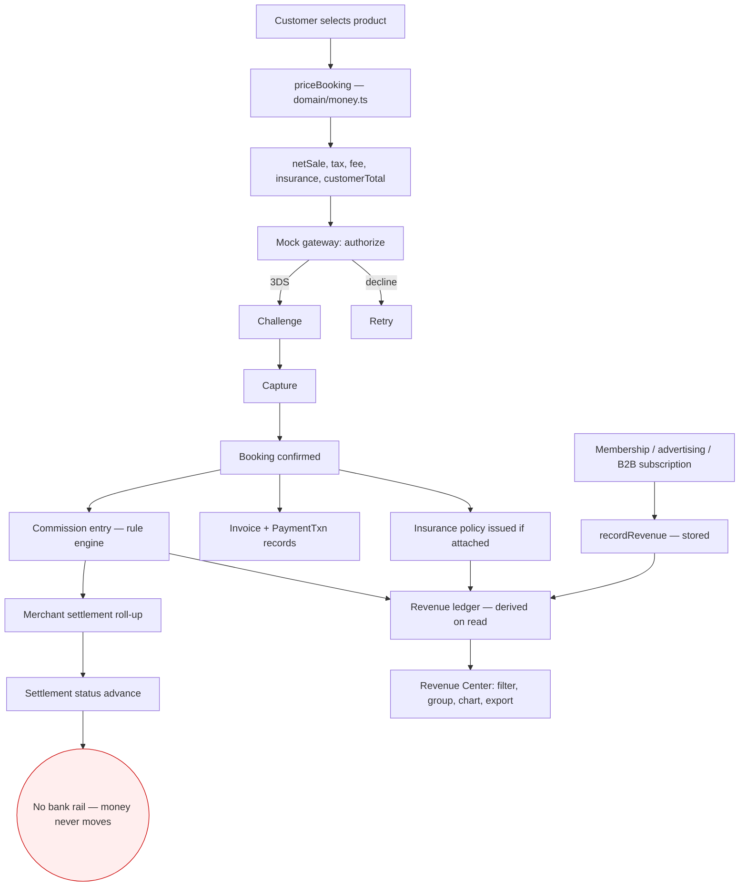

# 09 — Financial & Payment System Analysis

## How the financial system works today

---

## Audit of every financial capability

✅ implemented · 🟡 partial · 🔵 mock/stub · 🔴 missing

| Capability | Status | Detail |
|---|---|---|
| Payment gateway | 🔵 | `domain/payments.ts` — a simulator. Instruments carry `provider: "mock"`. **No card number is ever stored** — only brand, last-4 and expiry label, exactly as a tokenised instrument would. Outcome is chosen by which demo card the user picks, the same technique a real sandbox uses. |
| Payment methods | 🟡 | Card, wallet (bKash, Nagad), bank, cash-on-delivery, credit — as instrument *kinds*. No real processor for any of them. |
| Checkout | ✅ | Four-step, with hold, add-ons, insurance, discounts, membership upsell. |
| Authorization / capture split | ✅ | Modelled distinctly. |
| 3-D Secure | 🔵 | Step-up challenge simulated with a demo code. |
| Failed payments & retry | ✅ | Decline path, failure reasons, retry, `mark_failed` transition. |
| Deposit / balance payment plans | ✅ | `PaymentPlan` type and deposit flow at checkout. |
| Taxes | 🟡 | Single flat rate (7.5%) applied to net sale. Correctly excluded from revenue. No jurisdiction logic, no VAT/GST rules, no tax-inclusive pricing, no invoicing compliance. |
| Service / platform fees | ✅ | 2% of net sale, waivable by membership benefit. |
| Vendor commission | ✅ | Full rule engine (see file 08). |
| Customer fees | ✅ | Service fee; cancellation fees. |
| Discounts | ✅ | Percent and fixed, with an explicit `platformFundedDiscount` split so subsidies are visible. |
| Coupons | ✅ | Two kinds: platform-wide `Offer` promo codes owned by marketing, and per-customer wallet coupons. Checkout accepts either. |
| Promo codes | ✅ | With eligibility (all/new/returning/member/b2b), scope, status and date windows. |
| Loyalty points redemption | ✅ | Produces an `AppliedDiscount` that flows through the same pricing path, so commission is computed on the discounted net sale. |
| Wallet | 🔵 | A wallet module exists (stub-backed). No real balance, top-up or spend. |
| Refund | ✅ | Full lifecycle with policy-driven quoting. |
| Partial refund | ✅ | `RefundKind = full \| partial \| none`; `applyRefundToMoney` adjusts the money block. |
| Cancellation fee | ✅ | Four policy tiers; the platform takes a 20% admin share, the merchant keeps the rest — a real transfer, deducted from settlement. |
| Vendor payout | 🟡 | Settlement computes `netSettlement` correctly and advances status. Payouts module is stub-backed. **No bank rail.** |
| Settlement | ✅ | Per-merchant roll-up, refund adjustment, status machine, tested. |
| Invoice | 🟡 | Invoice records are created for every booking with subtotal, taxes, fees, discount, total and bill-to. **No PDF is generated.** |
| Receipt | 🟡 | Payment transactions recorded; no document. |
| Transaction history | ✅ | Customer-facing `/account/payments`; admin transactions list (stub-backed). |
| Payment status | ✅ | Full status set with a state machine. |
| Chargebacks | 🔴 | Disputes module exists (stub-backed) but there is no chargeback lifecycle, evidence submission, or liability assignment. |
| Currency conversion | 🟡 | All prices stored in USD; converted for display with static rates in `features/i18n/format.ts`. No live rates, no FX snapshot on settlement (though an `FxSnapshot` type exists in the domain model, unused in the money path). |
| Reconciliation | 🔵 | Screen exists, stub-backed. No processor statement to reconcile against. |
| Audit trail | ✅ | Every financial change recorded with actor, entity, before and after. |
| Revenue reporting | ✅ | Revenue Center with filters, grouping, charts and CSV export. |
| Merchant financials | ✅ | `merchantFinancials()` — earnings, commission, refund adjustment, pending vs completed settlement. |
| Platform financials | ✅ | `platformFinancials()` — GMV, net sales, discounts, subsidies, cancellation fees, taxes, fees, commission and reversals, insurance revenue vs provider share, merchant earnings, refunds, settlements, take rate. |

---

## What the financial architecture gets right

1. **One engine.** Nothing recomputes a commission inline. Every figure anywhere in the product comes from `priceBooking` / `platformFinancials`.
2. **Tax is never revenue.** It is tracked, reported, and excluded from the ledger entirely.
3. **The merchant's earning is never platform revenue.** The three pots (gross value, partner share, platform amount) never merge.
4. **Reversals are modelled, not implied.** A refund reverses commission, adjusts settlement, reverses loyalty points and unwinds the insurance policy — each as an explicit, audited operation.
5. **Subsidies are visible.** Platform-funded discounts appear as a negative revenue line rather than quietly reducing the take rate.
6. **Determinism.** No wall-clock reads and no randomness inside financial computation — the same inputs always produce the same numbers on server and client. This is what makes the figures testable, and there are 145 tests.

---

## Missing financial architecture for a real marketplace

### Tier 1 — required before taking a single real payment

| Component | Why | Notes |
|---|---|---|
| **Real payment gateway** | No money can be collected | Stripe / Adyen / local rails (bKash, Nagad, SSLCommerz for BD). Replace `authorize`/`complete3DS`/`capture`/`refund` bodies — the shapes already match. |
| **Server-side pricing authority** | The client currently decides what it is charged | Move `priceBooking` behind the API; the client may quote, only the server may charge. |
| **PCI scope decision** | Legal requirement | Hosted fields / gateway-hosted checkout keeps scope at SAQ-A. |
| **Webhook handling & idempotency** | Payments are asynchronous and can be delivered twice | Needs an idempotency key on every money-moving operation. |
| **Double-entry ledger** | Current model is derived-on-read, which is elegant for reporting but insufficient as a book of record | Add an immutable journal alongside the derived views. |
| **Payout rail** | Merchants must be paid | Stripe Connect / Adyen for Platforms / local bank transfer + payout scheduling. |
| **Merchant bank details + KYC** | Cannot pay an unverified party | Tied to merchant onboarding (file 06). |
| **Money-in / money-out reconciliation** | Must prove the platform's balance | Processor statements vs internal ledger, daily. |

### Tier 2 — required for multi-market operation

| Component | Why |
|---|---|
| **Tax engine** | Per-jurisdiction VAT/GST, tourist taxes, marketplace facilitator rules, tax-inclusive vs exclusive display |
| **Multi-currency storage** | Prices stored per market, not converted from USD; settlement currency per merchant |
| **Live FX with rate locking** | An `FxSnapshot` type exists but is unused; a booking must lock the rate it was priced at |
| **Invoice/receipt document generation** | PDF invoices, credit notes, sequential numbering per jurisdiction |
| **Escrow / client money handling** | Customer funds held before supplier delivery are regulated in many markets |
| **Chargeback lifecycle** | Notification, evidence, representment, liability, fee accounting |
| **Financial period close** | Locking a period so historical reports cannot silently change — a real risk with derived-on-read revenue |

### Tier 3 — scale and control

| Component | Why |
|---|---|
| Payout holdbacks and rolling reserves | Risk management against merchant failure |
| Fraud scoring and velocity rules | Card testing, booking fraud |
| Automated dunning for subscriptions | Membership and B2B renewals |
| Commission accrual vs cash recognition | The ledger already distinguishes `accrued` / `finalized`; accounting integration does not exist |
| Accounting system integration | Xero / QuickBooks / NetSuite export |
| Credit control automation for B2B | Credit limits exist; no automated suspension or collections |

---

## One structural caution

The **derive-on-read** design is the right choice for reporting consistency and it is genuinely elegant. But it means historical revenue figures will change if the commission rules or the money engine change. Before real money is involved, the platform needs a **point-in-time snapshot** written at the moment a booking is finalised — so that what was reported in March still reports the same in September. The `RevenueStatus` values (`accrued`, `finalized`, `reversed`, `adjusted`) already anticipate this; the snapshot itself does not yet exist.
