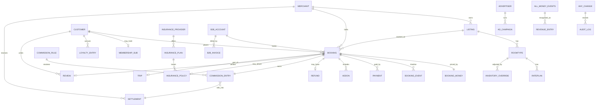

# 11 — Data Model & API Analysis

## There is no database

No ORM, no schema file, no migrations, no driver in `package.json`. What exists instead is a **fully normalised TypeScript data model** (`features/dashboard/domain/types.ts` plus per-module type files) that is, in effect, a schema specification waiting for a database.

This is more useful than it sounds: the entity shapes, relationships, status enumerations and constraints have already been thought through and are exercised by 145 passing tests. A database schema can be derived from them almost mechanically.

---

## Entities that exist in code

### Core booking

| Entity | Key fields | Notes |
|---|---|---|
| **Booking** | id, reference, status, productKind, channel, segment, merchant, customer, travelers[], money, addOns[], stay selection, payments[], events[], policy, tripId | The central record. 70+ fields. |
| **BookingMoney** | base, markup, discount, platformFundedDiscount, netSale, taxes, fees, insurance, customerTotal, commissionBase, commissionRate, commission, commissionRuleId, merchantEarning, platformRevenue, currency | Embedded value object — every figure in the product comes from here |
| **BookingAddOn** | id, label, unitPrice, quantity, total | |
| **BookingEvent** | at, type, actor, note, from, to | The timeline |
| **Traveler** | name, type, document, contact | |
| **StaySelection** | roomTypeId, ratePlanId, checkIn, checkOut, nights, units, guests | |
| **PaymentPlan** | kind, depositAmount, balanceDueAt | |
| **AppliedDiscount** | source, code, amount, platformFunded | |
| **FxSnapshot** | base, quote, rate, at | **Defined but unused** in the money path |

### Money

| Entity | Notes |
|---|---|
| **Payment** | Per-booking payment with method, status, amount |
| **PaymentAttempt** | Gateway attempt with outcome, 3DS state, retry count |
| **Refund** | Full lifecycle: kind, reason, status, quoted vs actual, policy applied |
| **RefundQuote** | Policy tier, refundable amount, cancellation fee, platform share |
| **CommissionEntry** | Per-booking, with status `pending \| settled \| reversed \| adjusted` |
| **CommissionRule** | 6 targeting levels, percent + fixed, floor/cap, basis, date window, specificity |
| **Settlement** | Per-merchant roll-up, status machine, refund adjustment |
| **RevenueEntry** | source, grossValue, partnerShare, amount, status, attribution |
| **CancellationPolicy / CancellationTier** | 4 policies with time-based tiers |

### Catalogue & inventory

| Entity | Notes |
|---|---|
| **Listing** (+ Hotel, Apartment, Resort, SharedRoom, ConventionHall, Transport, Tour, Activity, Visa) | Public catalogue types with per-vertical facets |
| **RoomType / RatePlan** | Derived deterministically per property |
| **InventoryOverride** | Revenue-manager edits to the baseline |
| **InventoryHold** | Checkout hold with expiry |
| **PricingRule** | Revenue-management automation |
| **Category / Amenity / Attribute** | Taxonomy (stub-backed) |

### Flights

| Entity | Notes |
|---|---|
| **FlightOffer / FlightSearchQuery / FlightSearchResult** | Search and offer model |
| **FlightBooking** | PNR, ticket numbers, passengers, ancillaries |
| **FlightPassenger / FlightContact / EmergencyContact** | |
| **Airline / Airport / Aircraft / Route / Schedule** | Reference data |
| **SeatMap / AncillaryOption / FarePricePoint / BoardingPass / VisaRequirement** | |

### Commerce & growth

| Entity | Notes |
|---|---|
| **Offer** | Promo code, seasonal, flash, member, combo — with eligibility, scope, status, windows |
| **ComboOffer / ComboItem** | Bundles |
| **MembershipPlan / MembershipSubscription / MembershipBenefits** | |
| **InsuranceProvider / InsurancePlan / InsurancePolicy** | |
| **Advertiser / AdCampaign** | Placement, budget, pricing model, metrics |
| **LoyaltyEntry / LoyaltyTierDef** | Points ledger |
| **WalletCoupon / Referral** | |

### B2B

| Entity | Notes |
|---|---|
| **B2BAccount** | Type, status, tier, commercial model, settlement terms, credit limit |
| **B2BSubUser** | Defined; **no login exists for one** |
| **B2BInvoice** | Consolidated invoicing with 6 statuses |

### People & platform

| Entity | Notes |
|---|---|
| **AuthUser / AuthSession / MockAccount** | Account model |
| **User** (dashboard) | Stub-backed platform user with roleId |
| **Customer** | Stub-backed |
| **MerchantRef** (domain) / **Merchant** (module) | **Two competing models — see file 06** |
| **Role / Permission / RouteRule** | RBAC |
| **SupportTicket** (+ messages, internal notes) | |
| **PlatformReview** | Verified-stay only, with aspects and moderation |
| **PlatformNotification** | Audience-scoped |
| **OutboundMessage / MessageTemplate / NotificationPreferences** | 5 channels, 10 templates |
| **AuditLogEntry** | actor, action, entity, before, after |
| **TelemetryEvent** | |
| **CMS page + workflow state** | Draft → review → publish |
| **TripCart / TripContext / TripItem / TripBooking** | |
| **UnifiedBooking** | Read-only projection across stay/flight/trip |

### Recommended entities not present

| Entity | Why needed |
|---|---|
| **MerchantApplication / KYCDocument / VerificationCheck** | Merchant onboarding |
| **BankAccount / PayoutBatch / PayoutTransaction** | Paying merchants |
| **LedgerJournal / LedgerLine** | Double-entry book of record |
| **TaxRule / TaxJurisdiction** | Multi-market tax |
| **ExchangeRate** (time-series) | FX with rate locking |
| **Document** (invoice/voucher/ticket PDF) | Nothing is generated today |
| **MediaAsset** | No upload exists |
| **Dispute / ChargebackEvidence** | Chargeback lifecycle |
| **Session / RefreshToken / DeviceRecord** | Real auth |
| **ApiKey / WebhookSubscription** | B2B API |
| **MerchantStaff** | Sub-users for suppliers |
| **Affiliate / AffiliateClick / AffiliatePayout** | Affiliate revenue |
| **SupplierBooking** (external reference) | Supplier confirmation loop |
| **ScheduledJob / JobRun** | Reminders, renewals, review invitations |
| **ConsentRecord / DataExportRequest** | GDPR |

---

## Entity relationships

---

## API analysis

### There are no APIs

Zero HTTP endpoints are served. What exists is the **service layer that will become the API**, in two families:

**Customer-facing services** (`services/`, 10 files, 3,857 LOC):

| Service | Would become |
|---|---|
| `auth.ts` | `POST /auth/login`, `/register`, `/verify`, `/reset`, `/profile` |
| `catalog.ts` | `GET /listings`, `/listings/:slug` |
| `search.ts` | `GET /search`, `/search/suggestions` |
| `checkout.ts` | `POST /bookings`, `POST /checkout/promo` |
| `flight.service.ts` | `POST /flights/search`, `GET /flights/offers/:id` |
| `flight-checkout.ts` | `POST /flights/bookings` |
| `account.ts` | `GET /me/*` |
| `trip.service.ts` | `GET/POST /me/trip` |
| `recommendation.ts` | `POST /recommendations` |
| `promotions.ts`, `content.ts`, `ai.ts` | `/offers`, `/content`, `POST /ai/messages` |

**Domain services** (`features/dashboard/domain/services.ts`, 18 services, 3,695 LOC) — `bookingService`, `refundService`, `commissionService`, `commissionRuleService`, `settlementService`, `revenueService`, `offerService`, `comboService`, `b2bService`, `insuranceAdminService`, `membershipAdminService`, `advertisingService`, `revenueManagementService`, `notificationService`, `auditService`, `platformService`, `messagingService`, plus module-level stub services.

Every one already takes `ListParams` (page, pageSize, sort, search, filters) and a `DomainScope` (merchantId / organizationId), and returns `Paginated<T>`. **The API contract is written; only the transport is missing.**

### The HTTP client is ready

`features/dashboard/data/http-client.ts` is complete and production-shaped: env-driven base URL, pluggable bearer-token provider, `AbortController` timeouts, five normalised error kinds, 422 field-error extraction, and optional response-schema validation. It deliberately throws when no base URL is configured so nobody ships half-wired code.

### Missing production requirements across all future APIs

| Requirement | Status |
|---|---|
| Authentication on every endpoint | 🔴 |
| Server-side authorization (the RBAC map exists; nothing calls it at a boundary) | 🔴 |
| Input validation at the boundary (Zod schemas exist for forms, not for requests) | 🔴 |
| Rate limiting | 🔴 |
| Idempotency keys on money operations | 🔴 |
| Pagination limits and cursor pagination | 🟡 offset only |
| Optimistic concurrency / versioning | 🔴 |
| Webhooks (inbound and outbound) | 🔴 |
| API versioning | 🔴 |
| Structured request logging and tracing | 🔴 |
| OpenAPI specification | 🔴 |
| CORS policy | 🔴 |

### Integrations required, by priority

| Priority | Integration | Purpose |
|---|---|---|
| 1 | **Payments** (Stripe/Adyen + local: bKash, Nagad, SSLCommerz) | Collect money |
| 1 | **Payouts** (Connect / For Platforms / bank transfer) | Pay merchants |
| 1 | **Email** (Postmark/SES) then **SMS** (Twilio) | The template registry is ready |
| 2 | **Maps & geocoding** (Mapbox/Google) | Replace the projection stand-in |
| 2 | **File storage** (S3/R2 + CDN) | No upload exists anywhere |
| 2 | **KYC/identity** (Onfido/Sumsub) | Merchant verification |
| 3 | **Hotel supply** (channel manager: SiteMinder/Cloudbeds, or Expedia/Booking APIs) | Real inventory |
| 3 | **Flights** (Amadeus/Sabre/Duffel NDC) | Real fares and ticketing |
| 3 | **Currency rates** (openexchangerates / ECB) | FX |
| 4 | **Insurance** (a licensed underwriter) | Real cover |
| 4 | **Tax** (Avalara/Stripe Tax) | Multi-market compliance |
| 4 | **Analytics & errors** (PostHog, Sentry) | Seams already shaped |
| 5 | **AI** (Claude API) | Provider interface already defined |
| 5 | **Push** (FCM/APNs), **WhatsApp** (Business API) | Channels already modelled |
