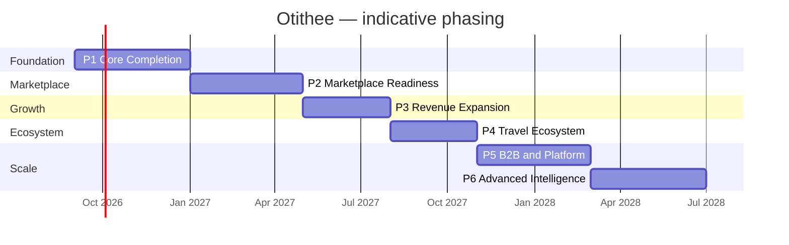

# 15 — Prioritised Roadmap

## Principle

The existing front end is an asset, not a liability. Every phase below **preserves it** and builds beneath it. The service signatures already in the repository are the API contract, so the sequence is: put a server behind the seam, secure it, connect it to the outside world, then monetise what already works.

Durations are indicative for a small dedicated team and should be re-estimated against actual staffing.

---

## Phase 1 — Core Completion *(~4 months)*

**Goal:** Make what already exists real, secure and shared between users.

### Features
1. Backend API + database, derived from the existing domain layer and service signatures.
2. Port the domain layer server-side (it has no React dependency and is already Node-testable).
3. Server-issued authentication: hashed passwords, signed `httpOnly` sessions, real OTP, refresh and revocation.
4. Server-side authorization on every endpoint, using the existing RBAC map and `DomainScope`.
5. Server-authoritative pricing, availability and commission.
6. One real payment gateway end-to-end, including refunds, webhooks and idempotency.
7. Real email delivery against the existing template registry; SMS second.
8. File and media upload (S3/R2 + CDN).
9. Unify the two data tiers — migrate all 42 stub-backed modules onto the persisted model.
10. Resolve the twelve contradictions in file 14, starting with the catalogue and merchant models.
11. Security headers, HTTPS enforcement, rate limiting, server-side immutable audit log.
12. CI/CD with type-check, lint and the 145 domain tests as gates; add component and E2E tests for the booking path.

### Why first
Nothing in later phases can be trusted, sold or operated without this. Every one of the ten vulnerabilities in file 13 becomes critical the moment a backend exists, which is why security is *inside* this phase, not after it.

### Dependencies
None. This is the root of the tree.

### Expected business impact
Converts a demonstration into a system that can hold real users and real money. Enables a closed pilot.

### Exit criteria
Two people on two machines can transact with each other; a real payment settles; a real email arrives; a penetration test has been run.

---

## Phase 2 — Marketplace Readiness *(~4 months)*

**Goal:** Let real supply onto the platform and pay it correctly.

### Features
1. **Merchant registration, onboarding and KYC** — application, documents, verification, contract, bank details, approval queue.
2. Merchant staff accounts and sub-roles.
3. Catalogue approval workflow (submit → review → approve/reject → publish), connected to the live public catalogue.
4. Real payout rail with schedules, statements, holdbacks and minimum thresholds.
5. Supplier confirmation loop — a booking is not confirmed until the supplier accepts.
6. Document generation: invoices, vouchers, e-tickets, receipts, credit notes.
7. Production tax engine with per-jurisdiction rules.
8. Multi-currency price storage, live FX and rate locking on booking (`FxSnapshot` already modelled).
9. Chargeback and dispute lifecycle.
10. Scheduled jobs: reminders, review invitations, renewals, hold expiry, settlement runs.
11. Real maps and geocoding.
12. Search availability filtering and zero-result recovery.

### Why second
Supply is the constraint on a marketplace. Commission logic is complete but earns nothing until merchants can join, sell and be paid.

### Dependencies
All of Phase 1.

### Expected business impact
First real GMV. First real commission. The platform becomes a marketplace rather than a catalogue.

### Exit criteria
An external merchant can self-register, be verified, publish inventory, receive a booking, and be paid — without engineering involvement.

---

## Phase 3 — Revenue Expansion *(~3 months)*

**Goal:** Turn already-built revenue logic into billed products.

### Features
1. **Cross-sell merchandising and measurement** — lead the flight → hotel → transfer → activity → insurance journey, and instrument attach rate. *Highest return in the entire roadmap because the mechanism already exists.*
2. Membership launch: pricing, subscription billing, dunning, renewal, benefit enforcement at checkout.
3. Merchant self-serve advertising: campaign purchase UI, budget management, performance reporting, invoicing.
4. Insurance with a licensed underwriter, replacing the demo provider.
5. Merchant subscription tiers.
6. Loyalty programme launch with a funded points liability model.
7. Affiliate / referral programme.
8. Abandoned-booking recovery and lifecycle email campaigns.
9. Conversion optimisation using data the domain already computes: scarcity, social proof, member pricing, recently viewed.
10. Financial period close and point-in-time revenue snapshots.

### Why third
Each of these multiplies revenue on transactions that are already flowing. Running them before Phase 2 would monetise an empty marketplace.

### Dependencies
Phases 1–2, plus commercial partnerships for insurance.

### Expected business impact
Take rate rises from commission-only to a diversified mix. Recurring revenue begins. Revenue per traveller increases materially through attach.

---

## Phase 4 — Travel Ecosystem *(~3 months)*

**Goal:** Become a trip platform rather than a booking site.

### Features
1. **Unified itinerary** — one document covering every component of a trip.
2. **Single trip booking reference** presented to the customer.
3. Multi-supplier payment allocation and split settlement.
4. **Refund orchestration** across suppliers, including partial-failure handling.
5. Trip-level cancellation with per-component policy resolution.
6. Curated bundles and packaged trips with differential margin.
7. Destination hubs: guides, weather, visa requirements, local transport.
8. Personalised recommendations driven by booking history.
9. Post-booking cross-sell ("you land Thursday — book your transfer").
10. Trip collaboration and sharing.

### Why fourth
This is the differentiator, and it is the payoff for the trip cart, recommendation engine, combo pricing and unified read model already built. It requires the multi-supplier money handling that Phase 2 provides.

### Dependencies
Phases 1–3.

### Expected business impact
Defensible differentiation, higher basket value, and a reason for travellers to return rather than compare.

---

## Phase 5 — B2B & Platform Expansion *(~4 months)*

**Goal:** Sell the platform itself.

### Features
1. Public B2B API with keys, scopes, rate limits, versioning and an OpenAPI specification.
2. Agency portal with sub-users, credit control, markup management and consolidated invoicing (the data model exists).
3. Corporate travel: policy engine, approval chains, expense integration, employee profiles.
4. White-label / multi-tenant deployment.
5. Wholesale net rates and contracted inventory.
6. Reseller network and agent management.
7. Partner marketplace and webhooks.
8. Native mobile apps (the channel model already supports `ios` / `android`).

### Why fifth
Highest revenue ceiling, longest sales cycles, and it requires a stable, proven core to sell against.

### Dependencies
Phases 1–4, plus a hardened, well-documented API.

### Expected business impact
Contract revenue independent of consumer demand; distribution leverage without proportional marketing spend.

---

## Phase 6 — Advanced Intelligence *(~4 months)*

**Goal:** Compete on decision quality.

### Features
1. ML-driven dynamic pricing built on the existing deterministic rule engine and pace metrics.
2. Demand forecasting and inventory optimisation.
3. Full personalisation engine.
4. Real AI concierge replacing the mock provider (the tool registry and provider interface already exist, and the tool-only data access guarantee carries over).
5. Advanced analytics: cohorts, LTV, attribution, elasticity.
6. Automated fraud detection.
7. Data products sold to hotels (market insight from RevPAR/pace data — very high margin).
8. Last-minute / distressed inventory marketplace.
9. Automated customer service with human escalation.

### Why last
Every item requires volumes of real transaction data that only exist after Phases 1–5.

### Dependencies
All prior phases; meaningful transaction history.

### Expected business impact
Margin expansion through better pricing, cost reduction through automation, and new high-margin data revenue.

---

## Cross-phase commitments

| Commitment | Applies from |
|---|---|
| Security is part of the definition of done for every endpoint | Phase 1 |
| Every new feature ships with tests | Phase 1 |
| No feature ships that the front end cannot already express | Phase 1 |
| Accessibility conformance checked per release | Phase 2 |
| Financial figures never change retroactively | Phase 3 |

## Top 10 immediate actions

1. Choose the backend stack and stand up the database schema from `domain/types.ts`.
2. Port the domain layer server-side and run the existing 145 tests against it.
3. Replace client authentication with server-issued sessions.
4. Move pricing, availability and commission behind the API.
5. Integrate one payment gateway end-to-end.
6. Integrate one email provider against the existing template registry.
7. Migrate the 42 stub-backed modules onto the persisted model.
8. Reconcile the two merchant models and connect the admin catalogue to the public site.
9. Build merchant registration with KYC.
10. Set up CI/CD with the domain tests as a gate, and add E2E coverage of the booking path.
