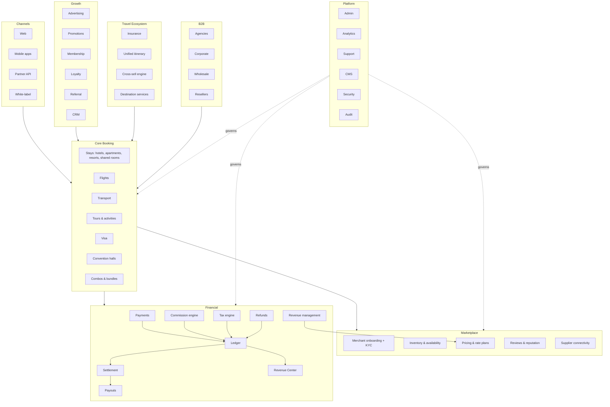

# 16 — The Complete Otithee Ecosystem

## Target architecture



## Build status by layer

| Layer | Built | Missing |
|---|---|---|
| **Core Booking** | All 10 product types, search, detail, checkout, lifecycle, amendments | Real supplier connectivity; time-slot inventory for experiences |
| **Marketplace** | Inventory engine, pricing, rate plans, reviews, merchant scoping | Merchant onboarding, KYC, approval workflow, channel manager |
| **Financial** | Money engine, commission rules, refunds, settlement, revenue ledger, revenue management | Gateway, payout rail, tax engine, double-entry journal, multi-currency |
| **Growth** | Advertising, promotions, membership, loyalty, combos | Referral programme, CRM depth, campaign tooling, merchant ad self-serve |
| **Travel Ecosystem** | Insurance, cross-sell engine, trip cart, combos, unified read model | Unified itinerary, refund orchestration, destination services |
| **B2B** | Accounts, credit, net rates, markup, statements, invoices, sub-user model | API, portal login for sub-users, corporate policy, white-label |
| **Platform** | Admin (65 modules), analytics, support, CMS workflow, RBAC design, audit | Server-side enforcement, system operations, runtime configuration |

---

## How the modules connect

### The booking spine

Everything financial hangs off one record. A booking carries an embedded `BookingMoney` block produced by a single pricing call, and every downstream module reads from it rather than recomputing:

```
Listing + Inventory + Rate plan
        ↓
  Offer/coupon/loyalty evaluation → AppliedDiscount
        ↓
  Commission rule resolution → rate or amount
        ↓
  priceBooking() → BookingMoney
        ↓
  ┌──────────┬─────────────┬──────────────┬────────────┐
Invoice   Payment    CommissionEntry   Insurance   Revenue ledger
                          ↓                             ↑
                    Settlement ────────────────────────┘
                          ↓
                       Payout
```

This is why the Revenue Center, the Commission page and a merchant's settlement can never disagree — they are three views of one computation, not three copies of a number.

### The trip spine

```
Trip context (destination, dates, travellers)
        ↓
Recommendation engine → groups by vertical
        ↓
Trip cart (shared across every vertical page)
        ↓
Trip checkout → N bookings
        ↓
Derived trip status ← component statuses
        ↓
Unified booking read model (stay + flight + trip in one list)
```

### The reversal spine

A refund is not a status change — it propagates:

```
Refund completed
   ├── Commission reversed
   ├── Settlement adjusted
   ├── Loyalty points reversed
   ├── Insurance policy unwound
   ├── Revenue entry reversed
   ├── Inventory released
   ├── Notification sent
   └── Audit entry written
```

Every branch is implemented and tested.

### The governance spine

```
Actor (role + scope)
   → Permission check (menu / route / component / server)
   → Domain service (scoped query)
   → State machine (is this transition legal?)
   → Mutation
   → Audit entry (actor, entity, before, after)
   → Notification (audience-scoped)
```

---

## Where the value concentrates

| Asset | Why it matters | Transferability |
|---|---|---|
| **The money engine** | The hardest part of a marketplace, and it is correct | Ports to any backend — no framework dependency |
| **The commission rule engine** | Commercial flexibility most platforms take years to add | Ports directly |
| **The revenue ledger** | One tested answer to "where do we make money" | Ports directly |
| **The domain model** | ~50 entities with relationships and constraints, tested | Becomes the database schema |
| **The service contract** | 18 services with pagination, scoping and filters | Becomes the API specification |
| **The UI** | 154 routes, complete, consistent, accessible-minded | Keeps working against a real API |
| **The test suite** | 145 checks proving the business rules | Runs unchanged against the ported domain |

## Where the risk concentrates

| Risk | Mitigation |
|---|---|
| Backend build is under-estimated because the front end looks done | Size it from the domain layer, not the screens |
| Prototype auth patterns survive into production | Security inside the definition of done, not a later pass |
| Derived-on-read revenue changes historical figures | Point-in-time snapshots at finalisation |
| Two data tiers migrate inconsistently | Migrate all 42 stub modules in one motion using the shared CRUD pattern |
| Supply never arrives | Merchant onboarding is Phase 2's first item, not its last |
| Client-authoritative pricing is retrofitted late | Move it in Phase 1 alongside the API, not after |

---

## The one-sentence version

> Otithee has already built the two hardest things in a travel marketplace — a correct money engine and a coherent multi-vertical product model — and none of the ordinary things: a server, a database, a payment rail and a way for suppliers to join.
